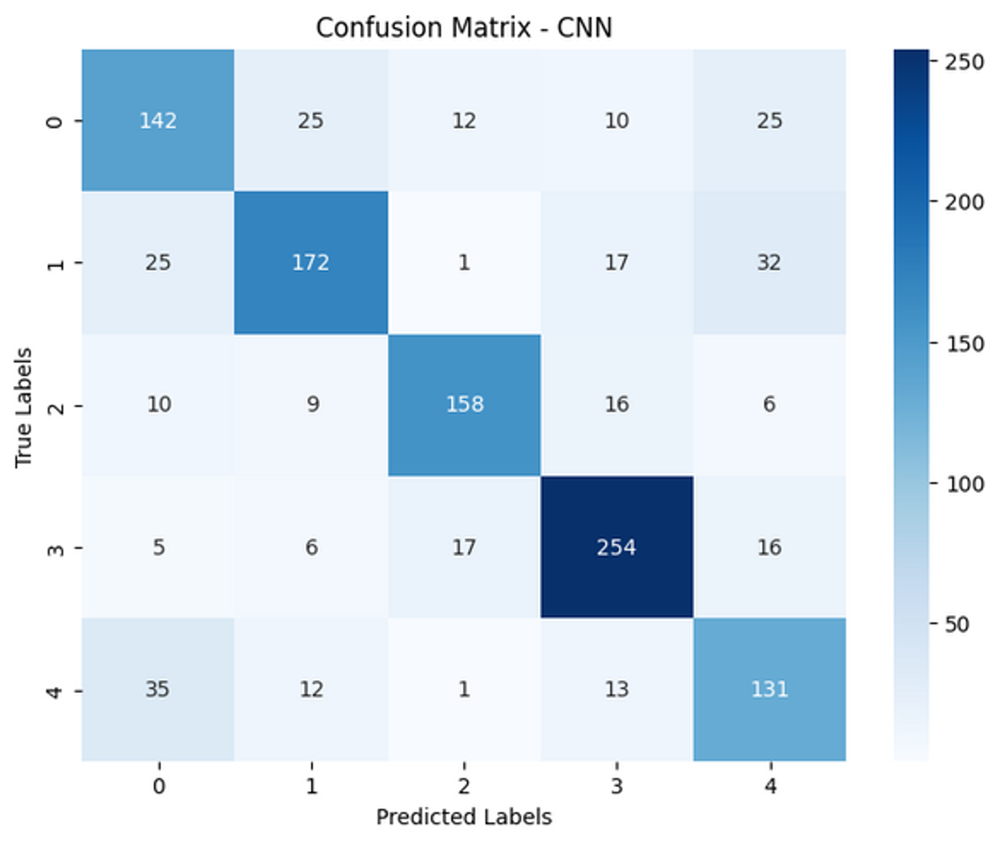
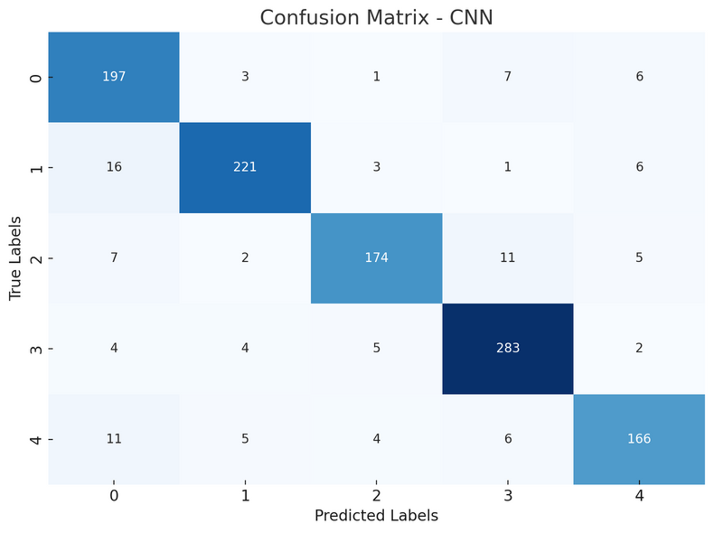

# HASIL ANALISIS TUGAS BESAR PENGOLAHAN CITRA DIGITAL

## Kelompok 20

### Muhamad Erwin Hariadinata (F1D022065)

### Muhammad Nune Huria Sakti (F1D022075)

### Nadya Azzahra (F1D022083)

### Safira Dwi Rizqia (F1D022096)

### Muhammad akbar setiadi (F1D022140)

# DetectSea: Deteksi Objek Laut dengan Metode CNN

## Latar Belakang

Lautan menutupi lebih dari 70% permukaan bumi dan menjadi rumah bagi berbagai flora dan fauna yang penting untuk ekosistem global. Hewan laut seperti ikan, mamalia laut, dan invertebrata membentuk keseimbangan ekosistem laut dan membantu berbagai aspek kehidupan manusia, seperti perikanan, pariwisata, dan penelitian ilmiah. Namun, karena kondisi lingkungan yang dinamis dan sulit dijangkau, eksplorasi dan pemantauan hewan laut sering kali menghadapi tantangan besar.

Convolutional Neural Networks (CNN) adalah salah satu metode deep learning yang paling populer dan efektif untuk analisis data visual, seperti gambar dan video. CNN dirancang untuk mengenali pola dan fitur dalam data visual melalui proses yang meniru cara kerja otak manusia dalam memproses informasi visual. Metode ini terdiri dari beberapa lapisan, termasuk lapisan konvolusi, lapisan pooling, dan lapisan fully connected, yang bekerja secara bersama-sama untuk melakukan ekstraksi fitur dan klasifikasi.

Pemilihan topik ini didasarkan oleh kebutuhan untuk mengembangkan metode yang lebih efisien dan akurat dalam mendeteksi dan memantau hewan-hewan laut. Program `detectSea` bertujuan untuk mendeteksi dan mengklasifikasikan berbagai spesies hewan laut dari citra dengan menerapkan CNN. Dengan menggunakan CNN, program ini dapat memproses data visual dengan cepat dan akurat, memungkinkan para peneliti dan konservasionis untuk melakukan pemantauan yang lebih efektif.

## Identifikasi Masalah

Lautan merupakan habitat vital bagi berbagai spesies flora dan fauna yang mendukung keberlangsungan ekosistem global serta berbagai sektor penting manusia seperti perikanan, pariwisata, dan penelitian ilmiah. Namun, tantangan besar yang dihadapi adalah sulitnya eksplorasi dan pemantauan hewan laut akibat kondisi lingkungan yang kompleks dan sulit dijangkau. Hal ini mengakibatkan keterbatasan dalam memperoleh data yang akurat dan konsisten mengenai populasi dan perilaku hewan laut. Convolutional Neural Networks (CNN), yang terkenal efektif dalam menganalisis data visual seperti gambar dan video, menjanjikan solusi untuk meningkatkan efisiensi dan ketepatan dalam mendeteksi serta memantau hewan laut. Melalui implementasi CNN dalam program `detectSea`, diharapkan dapat ditingkatkan kemampuan untuk mengenali spesies hewan laut dari citra dengan tingkat keakuratan yang tinggi. Namun, untuk mencapai hal ini, diperlukan penyelesaian masalah terkait dengan ketersediaan data yang berkualitas, validasi model yang konsisten dalam berbagai kondisi lingkungan laut yang berubah-ubah, serta integrasi teknologi ini ke dalam strategi konservasi laut yang berkelanjutan. Dengan mengatasi tantangan-tantangan ini, program `detectSea` diharapkan dapat memberikan kontribusi penting dalam pemahaman dan perlindungan terhadap keanekaragaman hayati di laut.

## Tujuan

Adapun tujuan dari pembuatan detectSea adalah sebagai berikut:

1. **Meningkatkan Efisiensi Pemantauan**: Mengimplementasikan Convolutional Neural Networks (CNN) dalam program `detectSea` untuk meningkatkan efisiensi dalam mendeteksi dan memantau berbagai spesies hewan laut dari gambar atau video, sehingga memungkinkan pengumpulan data yang lebih cepat dan akurat tentang populasi dan perilaku hewan laut.

2. **Mengatasi Tantangan Lingkungan**: Menyediakan solusi teknologi yang dapat menangani tantangan lingkungan yang dinamis dan sulit dijangkau di lautan, sehingga meningkatkan konsistensi dan validitas data yang diperoleh dari pemantauan hewan laut.

3. **Mendukung Konservasi dan Perlindungan**: Memperkuat upaya konservasi laut dengan menyediakan alat yang lebih efektif untuk identifikasi dan pengawasan terhadap keberagaman hayati laut, sehingga mendukung keberlanjutan ekosistem laut dan manfaat ekonomi yang bergantung padanya seperti perikanan dan pariwisata.

# DetectSea Berdasarkan Jenis Objek yang Berbeda

## Data Understanding

Pada Project detectSea ini digunakan kumpulan data (dataset) berupa gambar dari beberapa spesies laut, diantaranya coral, kepiting, ikan, ubur-ubur, serta bintang laut yang diambil dari situs kaggle dengan link https://www.kaggle.com/datasets/vencerlanz09/sea-animals-image-dataste jumlah rincian dari label yang digunakan adalah sebagai berikut:

*Gambar 2.1 Tampilan Objek*

- **Corals** dengan jumlah 200 gambar 
- **Crabs** dengan jumlah 250 gambar 
- **Fish** dengan jumlah 200 gambar 
- **Jellyfish** dengan jumlah 300 gambar 
- **Starfish** dengan jumlah 200 gambar

## Analisis Percobaan

### **Percobaan 0**:
------------------------

Pada percobaan 0 ini tidak dilakukan proses preprocessing sama sekali dikarenakan tujuannya adalah untuk mengetahui tingkat akurasi yang akan didapatkan tanpa proses prerpocessing terlebih dahulu.

#### Data Preparation

Pada bagian ini dilakukan proses resize pada function `Preprocess_images` terhadap seluruh gambar dengan ukuran 300x300

*Gambar 2.2 Distribusi Data*

Setelah itu dilakukan proses augmentasi dengan masing-masing gambar di-augmentasi sebanyak dua proses yakni proses rotasi sejauh 90 derajat dan sejauh -90 derajat.

*Gambar 2.3 Distribusi Data Setelah Augmentasi*

#### Modeling & Evaluation

Dari 3450 data tadi dilakukan pembagian data pelatihan dan data uji dengan perbandingan 80:20 sehingga didapat `Data Pelatihan = 2760` dan `Data Pengujian = 690`.
Lalu, didapatkan hasil evaluasi menggunakan berbagai model terhadap data pelatihan dan pengujian yang mana tiga model tersebut yaitu KNN, SVM, dan Random Forest.

**Tabel 2.1 Hasil Evaluasi Menggunakan GLCM Pada 3 Metode Berbeda**

| Model | Accuracy | Precision | Recall | F1 Score |
|-------|----------|-----------|--------|----------|
| KNN   | 0.671014 | 0.673427  | 0.671014 | 0.670043 |
| SVM   | 0.544928 | 0.538977  | 0.544928 | 0.539096 |
| RF    | 0.755072 | 0.756856  | 0.755072 | 0.753014 |

Setelah itu, hasil evaluasi tersebut juga ditampilkan pada confusion matrix. Confusion matrix ini menggambarkan seberapa baik model dapat mengklasifikasikan data dengan memperlihatkan persentase prediksi yang benar dari setiap kelas, serta kesalahan prediksi antara kelas-kelas yang berbeda.

*Gambar 2.4 Confusion Matrix Tanpa Preprocessing*

Selanjutnya dilakukan modeling dengan menggunakan model CNN dengan hasil evaluasi sebagai berikut:

**Tabel 2.2 Hasil Evaluasi Dengan Metode CNN**

| Class            | Precision | Recall | F1-Score               | Support |
| ---------------- | --------- | ------ | ---------------------- | ------- |
| 0                | 0.78      | 0.86   | 0.82                   | 145     |
| 1                | 0.87      | 0.83   | 0.85                   | 140     |
| 2                | 0.89      | 0.86   | 0.87                   | 120     |
| 3                | 0.92      | 0.91   | 0.92                   | 172     |
| 4                | 0.72      | 0.72   | 0.72                   | 113     |
| **Accuracy**     |           |        | **0.8420289754867554** | 690     |
| **Macro Avg**    | 0.84      | 0.83   | 0.84                   | 690     |
| **Weighted Avg** | 0.84      | 0.84   | 0.84                   | 690     |

Kemudian, ditampilkan juga confusion matrix khusus untuk model CNN ini yang menampilkan jumlah absolut prediksi yang tepat dan kesalahan prediksi untuk setiap kelas target.

*Gambar 2.5 Confusion Matrix Tanpa Preprocessing dengan CNN*

Setalh itu, ditampilkan juga hasil kurva accuracy dan kurva loss yang didapatkan berdasarkan data dari proses CNN tersebut:

*Gambar 2.6 Model Fitting Percobaan 0*

&nbsp;
### **Percobaan 1**:
------------------------

Pada percobaan 1 ini dilakukan berbagai proses preprocessing dengan tujuan untuk mengetahui tingkat akurasi yang akan didapatkan. Tahapan dari proses preprocessing tersebut adalah sebagai berikut:
Grayscale > Threshold > Edge Detection > Find Countur

#### Data Preparation

Untuk persiapan data sebelum dilakukan proses preprocessing, dilakukan persiapan data sama seperti `Percobaan 0` sebelumnya.

#### Modeling & Evaluation

Dari 3450 data tadi dilakukan pembagian data pelatihan dan data uji dengan perbandingan 80:20 sehingga didapat `Data Pelatihan = 2760` dan `Data Pengujian = 690`.
Lalu, didapatkan hasil evaluasi menggunakan berbagai model terhadap data pelatihan dan pengujian yang mana tiga model tersebut yaitu KNN, SVM, dan Random Forest.

**Tabel 2.3 Hasil Evaluasi Menggunakan GLCM Pada 3 Metode Berbeda dengan Preprocessing**

| Model | Accuracy | Precision | Recall | F1 Score |
|-------|----------|-----------|--------|----------|
| KNN   | 0.544928 | 0.538967  | 0.544928 | 0.53929  |
| SVM   | 0.527536 | 0.516103  | 0.527536 | 0.510629 |
| RF    | 0.691304 | 0.687119  | 0.691304 | 0.686287 |

Selanjutnya dilakukan modeling dengan menggunakan model CNN dengan hasil evaluasi sebagai berikut:

**Tabel 2.4 Hasil Evaluasi Dengan Metode CNN**

| Class            | Precision | Recall | F1-Score               | Support |
| ---------------- | --------- | ------ | ---------------------- | ------- |
| 0                | 0.46      | 0.39   | 0.42                   | 145     |
| 1                | 0.55      | 0.65   | 0.59                   | 140     |
| 2                | 0.65      | 0.41   | 0.50                   | 120     |
| 3                | 0.65      | 0.76   | 0.70                   | 172     |
| 4                | 0.44      | 0.50   | 0.47                   | 113     |
| **Accuracy**     |           |        | **0.5536231994628906** | 690     |
| **Macro Avg**    | 0.55      | 0.54   | 0.54                   | 690     |
| **Weighted Avg** | 0.56      | 0.55   | 0.55                   | 690     |

Kemudian, ditampilkan juga confusion matrix khusus untuk model CNN ini yang menampilkan jumlah absolut prediksi yang tepat dan kesalahan prediksi untuk setiap kelas target.

*Gambar 2.7 Confusion Matrix dengan Preprocessing Pada CNN*

Setalh itu, ditampilkan juga hasil kurva accuracy dan kurva loss yang didapatkan berdasarkan data dari proses CNN tersebut:

*Gambar 2.8 Model Fitting Percobaan 1*

#### Kesimpulan

Pada `Percobaan 1` ini didapatkan hasil akurasi dengan Model KKN, SVM, dan RF yang jauh lebih rendah dari percobaan sebelumnya dan dikarenakan proses _running_-nya lama maka kami melanjutkan percobaan dengan menggunakan Model CNN. Hasil dari model CNN pada percobaan ini dengan percobaan sebelumnya memang cukup jauh berbeda. Hal ini bisa dikarenakan terlalu banyak tahapan preprocessing yang digunakan sehingga dapat menurunkan performa model dan menghasilkan akurasi yang lebih rendah daripada percobaan sebelumnya.

&nbsp;
### **Percobaan 2**:
------------------------

Pada percobaan 2 ini dilakukan dua proses preprocessing dengan tujuan untuk mengetahui tingkat akurasi yang akan didapatkan. Tahapan dari proses preprocessing tersebut adalah sebagai berikut:
Grayscale > Threshold

#### Data Preparation

Untuk persiapan data sebelum dilakukan proses preprocessing, dilakukan penambahan jumlah data guna meningkatkan akurasi. Proses augmentasinya dilakukan dengan meng-augmentasi satu gambar menjadi empat gambar dengan proses augmentasi, dirotasi sejauh 90 derajat, sejauh -90 derajat, pencerminan terhadap sumbu-X, dan pencerminan terhadap sumbu-Y

*Gambar 2.9 Proses Augmentasi*

#### Modeling & Evaluation

Dari 5750 data tadi dilakukan pembagian data pelatihan dan data uji dengan perbandingan 80:20 sehingga didapat `Data Pelatihan = 4600` dan `Data Pengujian = 1150`.
Lalu, didapatkan hasil evaluasi sebagai berikut

**Tabel 2.5 Hasil Evaluasi Percobaan 2**

| Class            | Precision | Recall | F1-Score | Support |
| ---------------- | --------- | ------ | -------- | ------- |
| 0                | 0.85      | 0.77   | 0.81     | 214     |
| 1                | 0.89      | 0.86   | 0.88     | 247     |
| 2                | 0.80      | 0.82   | 0.81     | 199     |
| 3                | 0.83      | 0.89   | 0.86     | 298     |
| 4                | 0.83      | 0.83   | 0.83     | 192     |
| **Accuracy**     |           |        | **0.8409** | 1150   |
| **Macro Avg**    | 0.84      | 0.84   | 0.84     | 1150    |
| **Weighted Avg** | 0.84      | 0.84   | 0.84     | 1150    |

Kemudian, ditampilkan juga confusion matrix khusus untuk model CNN ini yang menampilkan jumlah absolut prediksi yang tepat dan kesalahan prediksi untuk setiap kelas target.

*Gambar 2.10 Confusion Matrix Percobaan 2*

Setalh itu, ditampilkan juga hasil kurva accuracy dan kurva loss yang didapatkan berdasarkan data dari proses CNN tersebut:

*Gambar 2.11 Model Fitting Percobaan 2*

#### Kesimpulan

Pada `Percobaan 2` ini didapatkan hasil akurasi yang lebih rendah dibandingkan dengan `Percobaan 0` dengan perbedaan yang cukup tipis yakni, `0.02`. Tetapi hasil dari percobaan ini jauh lebih tinggi jika dibandingkan dengan `Percobaan 1`. Pada percobaan ini kami menambah jumlah epoch sebanyak 50 dan kami gunakan `EarlyStopping` untuk mengatasi overfitting dan menggunakan ` restore_best_weights=True` untuk mengambil epoch-epoch terbaik saja. 

&nbsp;
### **Percobaan 3**:
------------------------

Pada percobaan 3 ini dilakukan dua proses preprocessing dengan tujuan untuk mengetahui tingkat akurasi yang akan didapatkan. Tahapan dari proses preprocessing tersebut adalah sebagai berikut:
Grayscale > Equalisasi Histogram

#### Data Preparation

Untuk persiapan data sebelum dilakukan proses preprocessing, dilakukan persiapan data sama seperti `Percobaan 2` sebelumnya.

#### Modeling & Evaluation

Dari 5750 data dilakukan pembagian data pelatihan dan data uji dengan perbandingan 80:20 sehingga didapat `Data Pelatihan = 4600` dan `Data Pengujian = 1150`.
Lalu, didapatkan hasil evaluasi sebagai berikut

**Tabel 2.6 Hasil Evaluasi Percobaan 3**

| Class            | Precision | Recall | F1-Score | Support |
| ---------------- | --------- | ------ | -------- | ------- |
| 0                | 0.65      | 0.66   | 0.66     | 214     |
| 1                | 0.77      | 0.70   | 0.73     | 247     |
| 2                | 0.84      | 0.79   | 0.81     | 199     |
| 3                | 0.82      | 0.85   | 0.84     | 298     |
| 4                | 0.62      | 0.68   | 0.65     | 192     |
| **Accuracy**     |           |        | **0.7452** | 1150   |
| **Macro Avg**    | 0.74      | 0.74   | 0.74     | 1150    |
| **Weighted Avg** | 0.75      | 0.75   | 0.75     | 1150    |

Kemudian, ditampilkan juga confusion matrix khusus untuk model CNN ini yang menampilkan jumlah absolut prediksi yang tepat dan kesalahan prediksi untuk setiap kelas target.

*Gambar 2.12 Confusion Matrix Percobaan 3*

Setalh itu, ditampilkan juga hasil kurva accuracy dan kurva loss yang didapatkan berdasarkan data dari proses CNN tersebut:

*Gambar 2.13 Model Fitting Percobaan 3*

#### Kesimpulan

Pada `Percobaan 3` ini didapatkan hasil akurasi yang lebih rendah dibandingkan dengan `Percobaan 2` dengan perbedaan `0.1`. Tetapi hasil dari percobaan ini jauh lebih tinggi jika dibandingkan dengan `Percobaan 1`. Pada percobaan ini terjadi penuruan tingkat akurasi bila dibandingkan dengan percobaan sebelumnya dikarenakan penggunaan tahapan preprocessing yang kurang baik sehingga pada percobaan berikutnya kami akan melakukan perubahan metode preprocessing.

&nbsp;
### **Percobaan 4**:
------------------------

Pada percobaan 4 ini dilakukan satu proses preprocessing saja yakni `Grayscale` dengan tujuan untuk mengetahui tingkat akurasi yang akan didapatkan.

#### Data Preparation

Untuk persiapan data sebelum dilakukan proses preprocessing, dilakukan persiapan data sama seperti `Percobaan 2` sebelumnya.

#### Modeling & Evaluation

Dari 5750 data dilakukan pembagian data pelatihan dan data uji dengan perbandingan 80:20 sehingga didapat `Data Pelatihan = 4600` dan `Data Pengujian = 1150`.
Lalu, didapatkan hasil evaluasi sebagai berikut

**Tabel 2.7 Hasil Evaluasi Percobaan 4**

| Class            | Precision | Recall | F1-Score | Support |
| ---------------- | --------- | ------ | -------- | ------- |
| 0                | 0.83      | 0.90   | 0.86     | 214     |
| 1                | 0.89      | 0.93   | 0.91     | 247     |
| 2                | 0.93      | 0.84   | 0.88     | 199     |
| 3                | 0.91      | 0.94   | 0.92     | 298     |
| 4                | 0.93      | 0.85   | 0.89     | 192     |
| **Accuracy**     |           |        | **0.8965** | 1150   |
| **Macro Avg**    | 0.90      | 0.89   | 0.89     | 1150    |
| **Weighted Avg** | 0.90      | 0.90   | 0.90     | 1150    |

Kemudian, ditampilkan juga confusion matrix khusus untuk model CNN ini yang menampilkan jumlah absolut prediksi yang tepat dan kesalahan prediksi untuk setiap kelas target.

*Gambar 2.14 Confusion Matrix Percobaan 4*

Setalh itu, ditampilkan juga hasil kurva accuracy dan kurva loss yang didapatkan berdasarkan data dari proses CNN tersebut:

*Gambar 2.15 Model Fitting Percobaan 4*

#### Kesimpulan

Pada `Percobaan 4` ini didapatkan hasil akurasi yang lebih tinggi dibandingkan dengan `Percobaan 2` dengan perbedaan `0.056` dan hasil dari percobaan ini jauh lebih tinggi jika dibandingkan dengan percobaan sebelumnya sehingga dapat kami simpulkan bahwa hanya dengan metode preprocessing `Graysacle` saja sudah cukup untuk mendapatkan nilai akurasi yang tinggi. Oleh karena itu, pada percobaan selanjutnya kami akan melakukan kombinasi untuk meningkatkan akurasi selain dengan metode grayscale.

&nbsp;
### **Percobaan 5**:   
------------------------

Pada percobaan 5 ini dilakukan dua proses preprocessing dengan tujuan untuk mengetahui tingkat akurasi yang akan didapatkan. Tahapan dari proses preprocessing tersebut adalah sebagai berikut:
Equalisasi Histogram > Grayscale

#### Data Preparation

Untuk persiapan data sebelum dilakukan proses preprocessing, dilakukan persiapan data sama seperti `Percobaan 2` sebelumnya.

#### Modeling & Evaluation

Dari 5750 data dilakukan pembagian data pelatihan dan data uji dengan perbandingan 80:20 sehingga didapat `Data Pelatihan = 4600` dan `Data Pengujian = 1150`.
Lalu, didapatkan hasil evaluasi sebagai berikut

**Tabel 2.8 Hasil Evaluasi Percobaan 5**

| Class            | Precision | Recall | F1-Score | Support |
| ---------------- | --------- | ------ | -------- | ------- |
| 0                | 0.84      | 0.87   | 0.85     | 214     |
| 1                | 0.92      | 0.92   | 0.92     | 247     |
| 2                | 0.96      | 0.88   | 0.92     | 199     |
| 3                | 0.90      | 0.94   | 0.92     | 298     |
| 4                | 0.86      | 0.82   | 0.84     | 192     |
| **Accuracy**     |           |        | **0.8939** | 1150   |
| **Macro Avg**    | 0.89      | 0.89   | 0.89     | 1150    |
| **Weighted Avg** | 0.89      | 0.89   | 0.89     | 1150    |

Kemudian, ditampilkan juga confusion matrix khusus untuk model CNN ini yang menampilkan jumlah absolut prediksi yang tepat dan kesalahan prediksi untuk setiap kelas target.

*Gambar 2.16 Confusion Matrix Percobaan 5*

Setalh itu, ditampilkan juga hasil kurva accuracy dan kurva loss yang didapatkan berdasarkan data dari proses CNN tersebut:

*Gambar 2.17 Model Fitting Percobaan 5*

#### Kesimpulan

Pada `Percobaan 5` ini didapatkan hasil akurasi yang lebih rendah dibandingkan dengan `Percobaan 4` dengan perbedaan yang cukup tipis yakni `0.003`. Tetapi hasil dari percobaan ini jauh lebih tinggi jika dibandingkan dengan percobaan-percobaan sebelumnya. Oleh karena itu, maka penggunaan metode `Equalisasi Histogram` sebelum metode `Grayscael` tidak cocok untuk diterapkan.

&nbsp;
### **Percobaan 6**:   
------------------------

Pada percobaan 6 ini dilakukan dua proses preprocessing dengan tujuan untuk mengetahui tingkat akurasi yang akan didapatkan. Tahapan dari proses preprocessing tersebut adalah sebagai berikut:
Gaussian Blur > Grayscale

#### Data Preparation

Untuk persiapan data sebelum dilakukan proses preprocessing, dilakukan persiapan data sama seperti `Percobaan 2` sebelumnya.

#### Modeling & Evaluation

Dari 5750 data dilakukan pembagian data pelatihan dan data uji dengan perbandingan 80:20 sehingga didapat `Data Pelatihan = 4600` dan `Data Pengujian = 1150`.
Lalu, didapatkan hasil evaluasi sebagai berikut

**Tabel 2.9 Hasil Evaluasi Percobaan 6**

| Class            | Precision | Recall | F1-Score | Support |
| ---------------- | --------- | ------ | -------- | ------- |
| 0                | 0.84      | 0.92   | 0.88     | 214     |
| 1                | 0.94      | 0.89   | 0.92     | 247     |
| 2                | 0.93      | 0.87   | 0.90     | 199     |
| 3                | 0.92      | 0.95   | 0.93     | 298     |
| 4                | 0.90      | 0.86   | 0.88     | 192     |
| **Accuracy**     |           |        | **0.9052** | 1150   |
| **Macro Avg**    | 0.91      | 0.90   | 0.90     | 1150    |
| **Weighted Avg** | 0.91      | 0.91   | 0.91     | 1150    |

Kemudian, ditampilkan juga confusion matrix khusus untuk model CNN ini yang menampilkan jumlah absolut prediksi yang tepat dan kesalahan prediksi untuk setiap kelas target.

*Gambar 2.18 Confusion Matrix Percobaan 6*

Setalh itu, ditampilkan juga hasil kurva accuracy dan kurva loss yang didapatkan berdasarkan data dari proses CNN tersebut:

*Gambar 2.19 Model Fitting Percobaan 6*

#### Kesimpulan

Pada `Percobaan 6` ini didapatkan hasil akurasi yang lebih tinggi dibandingkan dengan `Percobaan 4` dengan perbedaan yang cukup tipis yakni `0.009` dan hasil dari percobaan ini memiliki hasil akurasi paling tinggi jika dibandingkan dengan percobaan-percobaan sebelumnya. Maka dapat disimpulkan bahwa penggurangan noice pada gambar dengan menggunakan metode `Gaussian Blur` terbukti efektif untuk meningkatkan akurasi.

&nbsp;
### **Percobaan 7**:   
------------------------

Pada percobaan 7 ini dilakukan dua proses preprocessing dengan tujuan untuk mengetahui tingkat akurasi yang akan didapatkan. Tahapan dari proses preprocessing tersebut adalah sebagai berikut:
Median Blur > Grayscale

#### Data Preparation

Untuk persiapan data sebelum dilakukan proses preprocessing, dilakukan persiapan data sama seperti `Percobaan 2` sebelumnya.

#### Modeling & Evaluation

Dari 5750 data dilakukan pembagian data pelatihan dan data uji dengan perbandingan 80:20 sehingga didapat `Data Pelatihan = 4600` dan `Data Pengujian = 1150`.
Lalu, didapatkan hasil evaluasi sebagai berikut

**Tabel 2.10 Hasil Evaluasi Percobaan 7**

| Class            | Precision | Recall | F1-Score | Support |
| ---------------- | --------- | ------ | -------- | ------- |
| 0                | 0.85      | 0.88   | 0.86     | 214     |
| 1                | 0.93      | 0.91   | 0.92     | 247     |
| 2                | 0.89      | 0.87   | 0.88     | 199     |
| 3                | 0.92      | 0.91   | 0.92     | 298     |
| 4                | 0.85      | 0.86   | 0.85     | 192     |
| **Accuracy**     |           |        | **0.8904** | 1150   |
| **Macro Avg**    | 0.89      | 0.89   | 0.89     | 1150    |
| **Weighted Avg** | 0.89      | 0.89   | 0.89     | 1150    |

Kemudian, ditampilkan juga confusion matrix khusus untuk model CNN ini yang menampilkan jumlah absolut prediksi yang tepat dan kesalahan prediksi untuk setiap kelas target.

*Gambar 2.20 Confusion Matrix Percobaan 7*

Setalh itu, ditampilkan juga hasil kurva accuracy dan kurva loss yang didapatkan berdasarkan data dari proses CNN tersebut:

*Gambar 2.21 Model Fitting Percobaan 7*

#### Kesimpulan

Pada `Percobaan 7` ini didapatkan hasil akurasi yang lebih rendah dibandingkan dengan `Percobaan 4` dengan perbedaan yang cukup tipis yakni `0.006` dan hasil dari percobaan ini juga memiliki hasil akurasi yang lebih rendah jika dibandingkan dengan percobaan sebelumnya. Maka dapat disimpulkan bahwa penggurangan noice pada gambar dengan menggunakan metode `Median Blur` terbukti kurang efektif untuk meningkatkan akurasi berbeda dengan penggunaan metode pada percobaan sebelumnya.